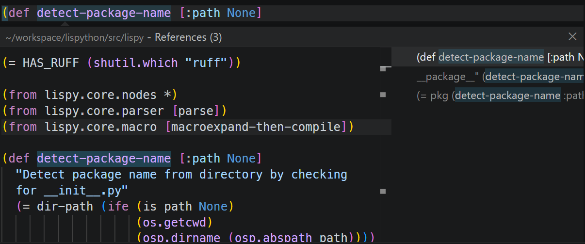

# LisPython for Visual Studio Code

Language support for [LisPython](https://github.com/jetack/lispython) (`.lpy`) — a Lisp-like syntax for Python with Lisp-like macros.

## Features

- **Syntax highlighting** — full TextMate grammar covering special forms, operators, strings, f-strings, macros, and keywords
- **Bracket matching** and rainbow parens (via VS Code's built-in bracket pair colorization)
- **Language server** powered by [lpy-lsp](https://github.com/jetack/lispython):
  - **Diagnostics** — parse and compile errors reported inline
  - **Document outline** — functions, classes, macros, variables, imports (`Ctrl+Shift+O`)
  - **Hover** — documentation for all special forms, operators, and Python builtins
  - **Go to Definition** (`F12`) — jumps to local, imported, and workspace-wide definitions
  - **Find All References** (`Shift+F12`) — all occurrences of a symbol



## Requirements

This extension requires the **LisPython** package to be installed in a Python environment:

```bash
pip install lispython
```

This installs the `lpy-lsp` language server used by this extension.

## Setup

After opening a `.lpy` file for the first time:

1. Click the **LisPy: ...** indicator in the status bar (bottom right)
2. Select the Python interpreter that has `lispython` installed
   (auto-discovers system Python, workspace `.venv`, and parent venvs)

The LSP server will restart with the selected interpreter.

## Commands

| Command | Description |
|---|---|
| `LisPython: Select Python Interpreter` | Pick the Python interpreter for the LSP server |
| `LisPython: Restart Language Server` | Restart the LSP server after changing settings |

## Settings

| Setting | Default | Description |
|---|---|---|
| `lispython.lsp.pythonPath` | `python3` | Path to the Python interpreter that has lispython installed |

## About LisPython

LisPython is a Lisp-like syntax layer for Python — 100% compatible with Python libraries, with Clojure-inspired macros (`defmacro`, quasiquote, unquote, splice).

```lpy
(require lispy.macros *)

(def fib [n]
  (if (< n 2)
      n
      (+ (fib (- n 1)) (fib (- n 2)))))

(defmacro when [condition *body]
  (return `(if ~condition (do ~@body))))
```

Learn more at https://github.com/jetack/lispython.

## License

MIT
